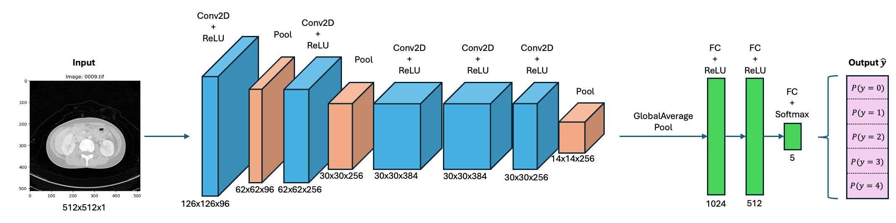

# Delta-IQA: A Convolutional Neural Network for Automatic Quality Assessment of CT Images
Welcome to the GitHub repository for the Delta-IQA (Delta Image Quality Assessment) model. This model is a Convolutional Neural Network, created for the purpose of automatically assessing the image quality of Computed Tomography scans. 

Traditionally, image quality assessment involves scanning physical test objects (phantoms) to measure image properties such as noise, contrast, and resolution. Delta-IQA replaces this tideous, time-consuming, manual approach with a continuous insight into image quality, performed on actual patient CT images. The scoring is based upon a Likert scale scoring from 0-4 from radiologists, and is designed to represent the ability for radiologists to properly assess an image, not to calculate image properties that are seperate from this ability.

This model was created at the request of the Leiden University Medical Centre.
## Model Architecture 

## Requirements 
- Python 3.10.16
- Tensorflow 2.18.1
- Keras 3.6.0
- Numpy 2.0.2
- Scipy 1.15.3
- Pandas 2.2.3
- Matplotlib 3.10.3
- OpenCV 4.11.0.86
- Scikit-learn 1.6.1
- Scikit-image 0.25.2

## Dataset
The LDCTIQAC 2023 dataset used for training, testing and internal validation is available [here](https://ldctiqac2023.grand-challenge.org).  
Images from the [Cancer Imaging Archive](https://www.cancerimagingarchive.net/collection/ldct-and-projection-data/), using scores from the Leiden University Medical Centre, were used for external validation. 

## Performance of the model
On the internal validation set, the overall accuracy is 0.64. 

## Intended Use
- Intended to be used as an automated Image Quality Assessment method for CT images from real patients, in a research context.
- Intended to be used by clinical professionals working with CT scanners, clinical physicists performing quality assurance and researchers.
- Not suitable for non-CT images (e.g. PET or MRI), non-transverse or non-axial scans, different patient groups without prior local validation, or diagnostic applications.

## Ethical Considerations
- No personal information was used, and all data were acquired from open-use data sources.
- Before implementation in clinical practice, severe testing needs to be done to ensure the model prediction does not result in wrongful consequences for CT settings, which could potentially be harmful for the patient.

## Caveats and Recommendations
- Scoring from the internal and external validation sets was not compared. Further research needs to study inter-observer variability. 
- Only a small portion of CT protocols were covered in the dataset: extensive testing on a larger, heterogeneous dataset needs to be conducted.
- This model is not ready for integration into a clinical pipeline, as no implementable software package has been constructed.

## Credits
Created by: Lars Jongsma, Koen Walet, Joey Mulder & Thomas Dijkstra (2025).
